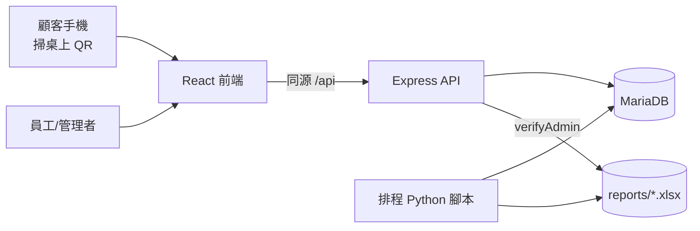

# HYPE 點餐系統

為實體酒吧「HYPE」開發並上線營運的點餐與帳務系統。屬於接案專案（有償，2025/07–2025/12），從需求訪談、現場部署到營運期維護皆由我獨立負責。

## 專案背景

酒吧一樓 A01–A08、二樓 B01–B06 共 14 桌，每桌貼有獨立 QR 碼。顧客掃碼點餐、店家計時收取場地費（每人每小時），兩種計價方式要在同一張帳單上並存。營業時間跨越午夜，「今天」對這間店來說是前一天中午到次日清晨。

## 系統架構



- 前端：React + react-router-dom，無全域狀態庫，購物車存在 `localStorage`（key 依桌號區分）
- 後端：單檔 Express app，JWT 驗證、bcrypt 雜湊密碼，MariaDB 用 `mysql2/promise` 連線池
- 報表：三支獨立的 Python 排程腳本，各自連線資料庫、輸出 `.xlsx`，由後端提供權限控管的下載端點

## 三種角色

| 角色 | 能做什麼 |
|---|---|
| 顧客 | 掃桌上 QR 進入點餐頁，加入購物車後送出訂單／場地費 |
| 員工 | 檢視/出餐訂單、管理場地費計時、藍牙熱感印表機出單 |
| 管理者 | 以上全部，加上查看利潤報表、下載 xlsx、管理員工帳號 |

## 上線後遇到的問題與修正

**主機重開後時區跑掉**
VM 重開會回到 UTC，訂單時間整批偏移 8 小時。修正：`mysql2` 連線池明確指定 `timezone: '+08:00'`，三支 Python 腳本各自讀 `.env` 的同一份設定，統一用 Asia/Taipei。

**客人被多收錢**
點餐備註若以數字結尾（例如「甜度:正常」被誤判成別的格式），會被加價解析的正則誤認成附加費用。修正：解析加價前，先跳過任何含冒號的備註 token（`冰塊:正常`、`甜度:正常` 這類標籤不是加價）。這個規則原本只加在 Node 端，月結報表用的 Python 版一度沒同步，此次整理已補上。

**跨午夜的營業日**
酒吧的「一天」不是日曆日，而是前一天 12:00 到次日 07:00。後端查詢與前端時間窗都照這個定義處理，而不是用系統的 00:00–23:59。

**免費試用期到期，服務中斷**
GCP 三個月免費試用到期後 VM 被停用，當時以遠端桌面連回店家電腦重啟主機才恢復服務。

## 為什麼下線

1. 2025/10 免費試用期到期，主機一度被自動停用
2. 開發者出國、隨後入伍，交接期間找不到人接手維護
3. 店家持續負擔每月費用，最終選擇不續訂
4. GCP 專案被刪除，VM 與資料庫一併消失，只剩 Google Drive 上的程式碼備份

三個教訓：

- **免費試用不是永久免費。** 我當時判斷試用期過後系統就不會再收費，這個判斷是錯的——GCP 免費方案本來就不含對外 IP，只要對外服務就一定會產生費用。
- **沒有帳單警示，也沒有任何監控。** 直到店家回報系統壞掉才知道出事，而不是在第一筆意外費用出現時就被通知。
- **只有我一個人能維護（bus factor = 1），且沒有基礎設施即程式碼。** 程式碼備份救不回一台被刪除的 VM——備份程式碼跟備份一套可重建的系統是兩件事。

## 如果重做

- 常駐 VM 換成 Cloud Run 或靜態託管 + serverless API，把「按流量計費」的風險降到最低
- 部署腳本與環境設定納入版控，不要只存在某一台機器的記憶裡
- 資料庫定期匯出備份，而不是只備份程式碼
- 在雲端主機一開始就設定預算警示

## 本機執行

```bash
# 後端
cd gpt
cp .env.example .env   # 填入 DB 帳密與 JWT_SECRET
npm install
npm start               # http://localhost:5000

# 前端
cd gpt/client
npm install
npm start               # 開發模式；npm run build 產生 client/build 交給後端 serve

# 資料庫
mysql -u root -p order_db < schema.sql
mysql -u root -p order_db < seed_menu_items.sql
```

Python 排程腳本讀取同一份 `.env`：

```bash
pip install -r requirements.txt
python daily_complete_order_export.py
```

## 備註

`client/src/components/data.js` 與 `seed_menu_items.sql` 內的品項與價格為示範資料，非店家真實菜單。
